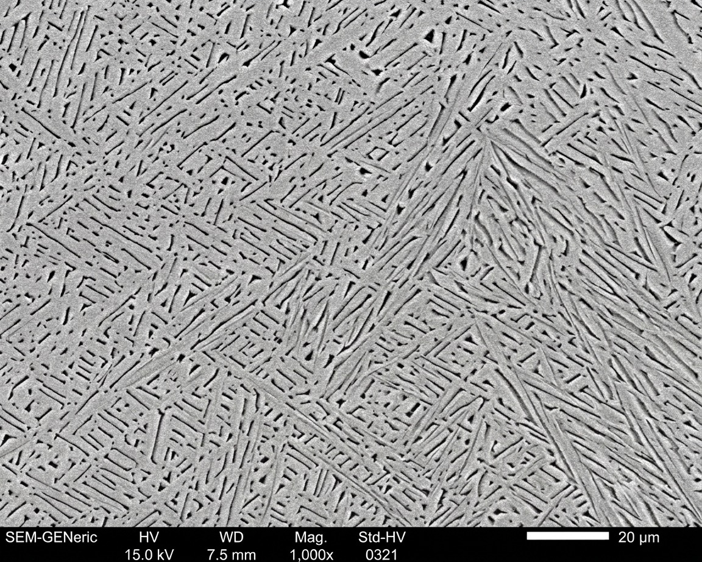
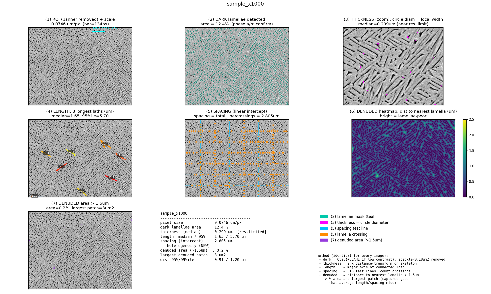

<!-- English | [日本語](README.ja.md) -->

# SEM Analyzer

> A desktop tool that automatically quantifies the **thickness, length, spacing, and denuded zones** of lamellar microstructures from SEM images.
> It removes operator-to-operator variation by processing every image with the same algorithm in one batch.

> **Runs entirely on your own machine.** Images are analyzed locally — they never have to be uploaded anywhere.

---

## The problem it solves

| | |
|---|---|
| **Problem** | Manual evaluation of SEM microstructures varies by operator and by repetition, making quantitative comparison between samples difficult. In particular, *microstructural non-uniformity* is hard to put a number on with conventional methods. |
| **Solution** | The tool detects the scale bar automatically, converts pixels to µm, and applies one identical algorithm to every image. On top of the usual geometric metrics, it **quantifies denuded zones (lamellae-poor regions) from a distance map to the nearest lamella**, capturing the non-uniformity that averages alone miss. |
| **Result** | Point it at a folder and every image is processed at once. Metrics are exported as CSV and annotated panel images, enabling reproducible, operator-independent comparison. |

---

## Metrics

| Metric | What it measures | Method |
|---|---|---|
| Lamella thickness (median) | Width of a single lamella | Distance transform on the skeleton × 2 |
| Lamella length (median / 95th) | Distribution of lamella length | Major-axis length of connected components |
| Lamella spacing | Gap between lamellae | Linear intercept (horizontal & vertical test lines, counting crossings) |
| Denuded area fraction | Area fraction of lamellae-poor regions | Regions where the distance to the nearest lamella exceeds a threshold (default 1.5 µm) |
| Largest denuded patch | Area of the single largest denuded region | Largest connected component among denuded regions |
| Distance 95th / 99th percentile | Indicator of microstructural non-uniformity | Percentiles of the distance map |

> **The denuded-zone metrics are this tool's key differentiator.**
> Two samples can share the same average lamella spacing and length yet differ greatly in how *uneven* the structure is.
> Quantifying that heterogeneity from a distance map opens the door to correlation analysis with material properties.

---

## Example output

### Sample A — dark lamellae (1,000×)

A typical case where lamellae appear dark in the SEM image. Contrast direction (dark vs. bright lamellae) is detected automatically, so no setting change is needed for bright-lamellae images either.

| Input | Output panel |
|---|---|
|  |  |

```
Lamella thickness (median) : 0.299 µm
Lamella length   (median)  : 1.65 µm
Lamella spacing            : 2.805 µm
Denuded area fraction      : 0.19 %
Largest denuded patch      : 3.0 µm²
Distance 95th percentile   : 0.911 µm
```

---

## Features

- **Automatic scale-bar detection** — reads the scale bar from the info banner at the bottom of the image and converts pixels to µm
- **Magnification auto-detection from filename** — infers magnification from names like `sample_x1000.jpg`
- **Contrast-inversion handling** — distinguishes dark and bright lamellae automatically with Otsu's method
- **Batch processing** — point it at a folder and every image is processed at once
- **GUI / CLI** — a packaged executable is available for environments without Python
- **Runs offline / locally** — confidential images never leave your computer
- **Non-ASCII path support** — works with Japanese (and other) folder and file names

---

## Output structure

```
analysis_out/
├── all_metrics.csv              ← one row of metrics per image
└── <image_name>/
    ├── panel_all_metrics.png    ← master panel showing which metric is measured where
    ├── 01_roi.png               ← analysis region
    ├── 02_dark_mask.png         ← lamella detection result
    ├── 03_denuded_heatmap.png   ← denuded-zone heatmap
    ├── 04_denuded_mask.png      ← denuded-zone mask
    ├── metrics.json             ← numeric results (JSON)
    └── log.txt                  ← processing log
```

---

## Tested environment

- Windows 10 / 11
- Python 3.9 or later
- Dependencies: numpy, opencv-python, matplotlib, scipy, scikit-image

---

## Usage (executable)

A standalone executable that does not require a Python environment is available.
Please get in touch if you would like it.

## Usage (Python)

```bash
pip install numpy opencv-python matplotlib scipy scikit-image

# GUI
python sem_gui.py

# Command line (batch)
python sem_core.py ./images
```

---

## Limitations

- Lamella detection is based on Otsu's method (with CLAHE for low-contrast images), so detection accuracy drops on extremely blurred images.
- It does not identify α/β phases. It measures light/dark contrast geometrically.
- Thickness values are affected by resolution when features approach the pixel scale (this is noted on the panel).

---

## License

Viewing and evaluation of the code, sample outputs, and documentation in this repository are free.
**Commercial use, modification, redistribution, or integration requires a license.**
For commercial licensing — or a one-off analysis of your own images — please get in touch via the form or email below.

© Forge Analytics. All rights reserved.

---

## Author & contact

**Forge Analytics** — analysis & automation for manufacturing.

We take on SEM analysis automation, DOE (design of experiments) analysis, and Python-based workflow automation.
Everything is handled in writing — no calls or meetings required.

- Web: https://forgeanalyticsjp-prog.github.io
- Contact: the form on the site above (or email)

> The technical background is explained in the article "Automating EBM microstructure evaluation." (link to be added after publication)
